# AcademyOS Desktop — Tuition & Coaching Management Client

AcademyOS Desktop is a production-grade, offline-first tuition, coaching institute, and academy management system. It is designed to completely eliminate manual paper journals, notebook-based admissions, and complex Excel ledgers.

---

## 1. Why AcademyOS Exists & Problems Solved

Tuition academies, coaching centers, and training institutes often struggle with administrative overhead due to a reliance on paper books or manual spreadsheets. This leads to key issues:
*   **Lost Revenues**: Tracking payment installments, outstanding balances, and discounts across hundreds of students in notebooks leads to missed collection windows.
*   **Time Overhead**: Staff spend hours compiling dynamic reports, tracking active student cohorts, and calculating outstanding fee lists.
*   **Data Corruption & Exposure**: Multi-user Excel files are prone to accidental modifications, lack data validation constraints, and lack transactional rollbacks.
*   **Internet Dependencies**: Cloud-based systems fail when connectivity drops. AcademyOS guarantees **100% offline continuity**; data is stored in a local SQLite database that runs without internet.

---

## 2. Key Features

*   **Student Cohorts Directory**: Full profile directory logging student registration status, addresses, custom contacts, and enrollment timelines.
*   **Outstanding Dues Ledger**: Live fee tracker summarizing base course fees, applied discounts, paid balances, and remaining outstanding dues with PDF receipt generation.
*   **Enquiry Sales Pipeline**: A lead manager to register enquiries, coordinate follow-up windows, and promote leads to active student records with a single click.
*   **Staged Data Import Pipeline**: Validate spreadsheets and text file rows in a database staging layer, highlighting errors before final commit.
*   **Automated Transactional Backups**: Instant, hot backups built on the native SQLite Backup API to pack data, logs, and PDF files.
*   **Cryptographic Licensing Lock**: Offline hardware-fingerprint validation and clock-tampering detection to protect commercial distributions.
*   **Offline OCR Parsing**: Image scanner to parse scanned receipt pages offline and extract text fields utilizing Tesseract OCR.

---

## 3. System Architecture & Workflows

### Final Architecture
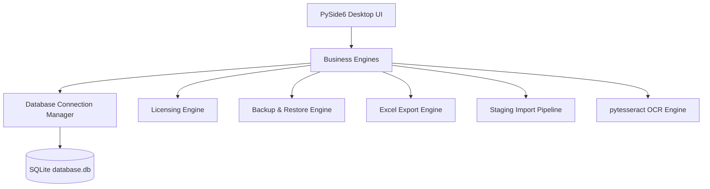

### Database Schema Entity Relationship
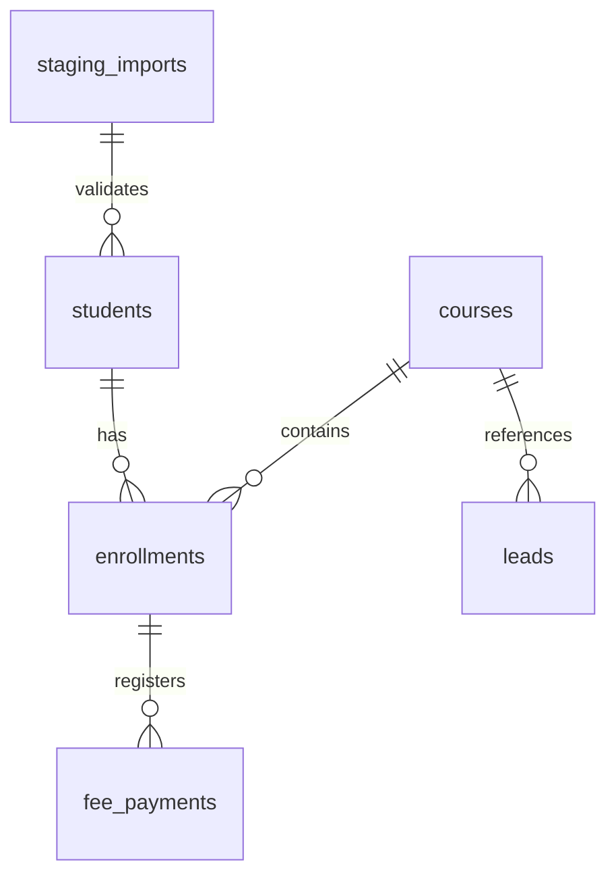

### Data Import Pipeline
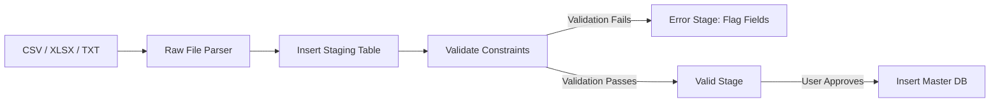

### Offline Licensing & Activation key
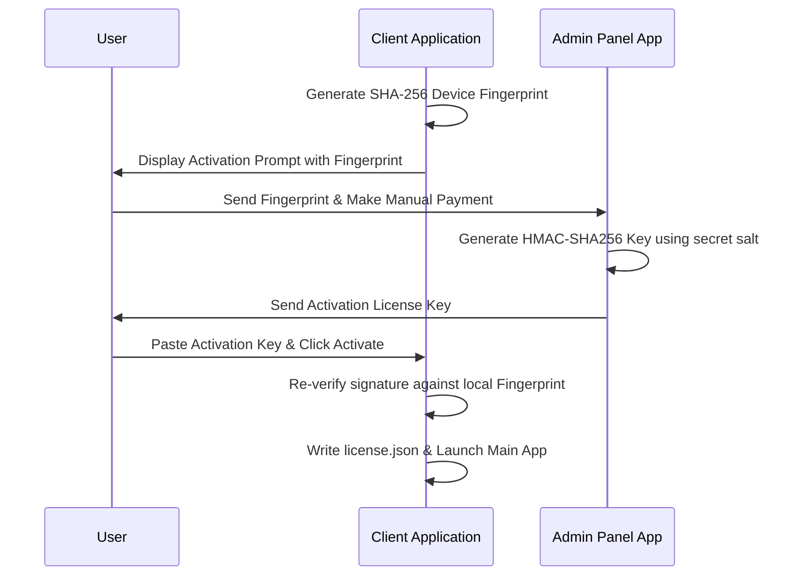

### Backup & Restore Integrity
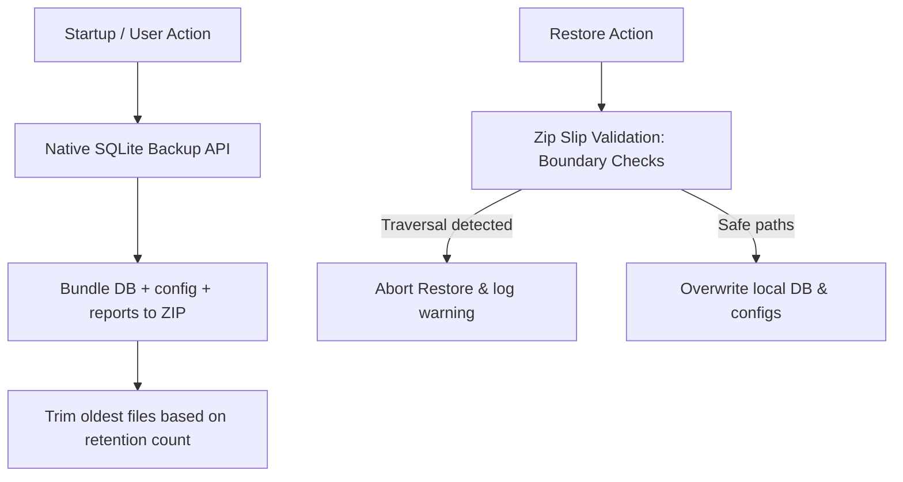

---

## 4. Screenshots

| Dashboard | Student Management |
|---|---|
| 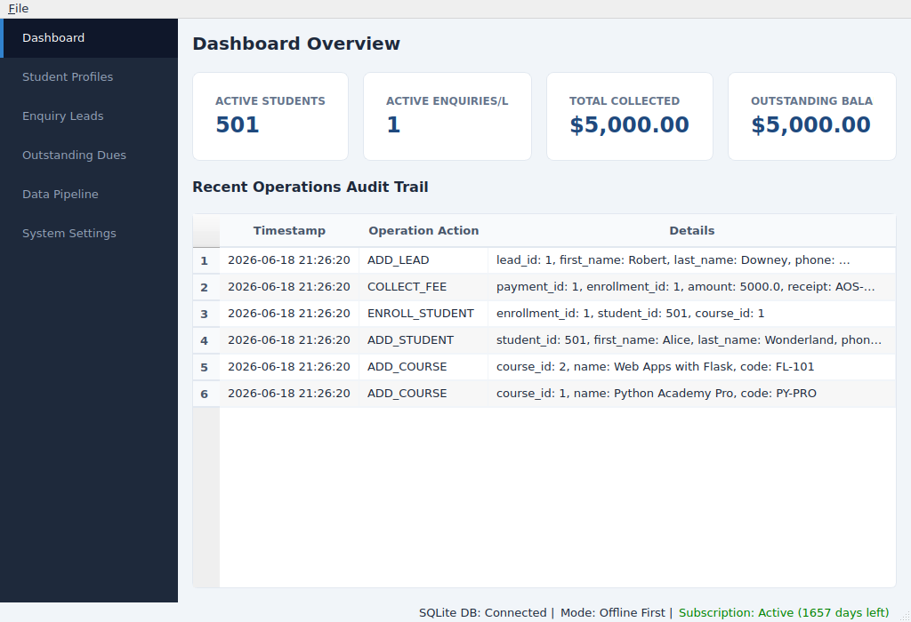 | 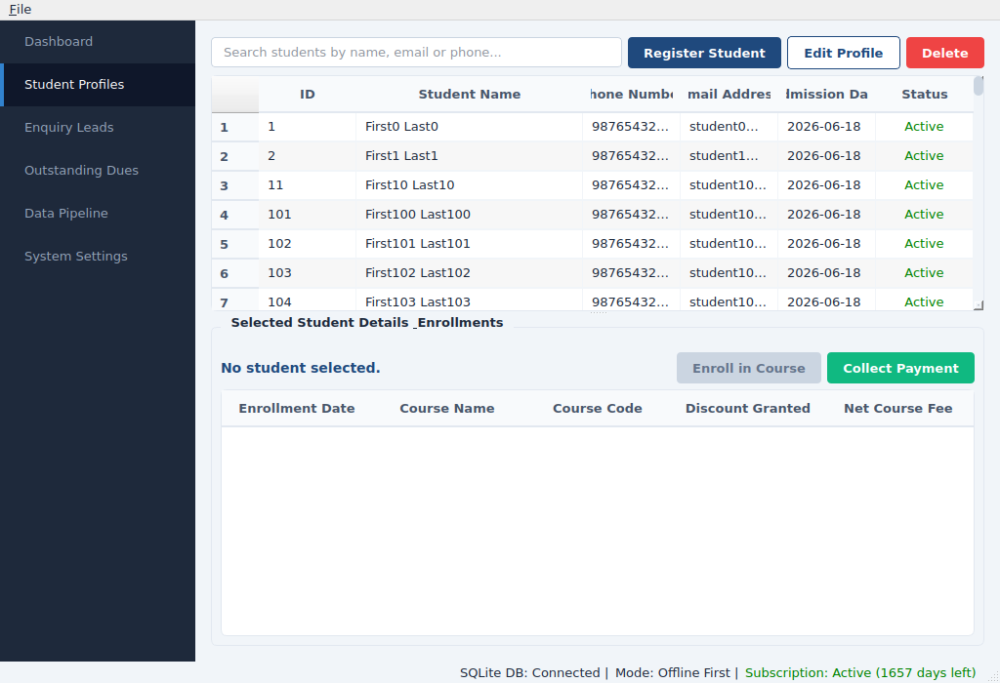 |

| Fee Ledger | Lead Pipeline |
|---|---|
| 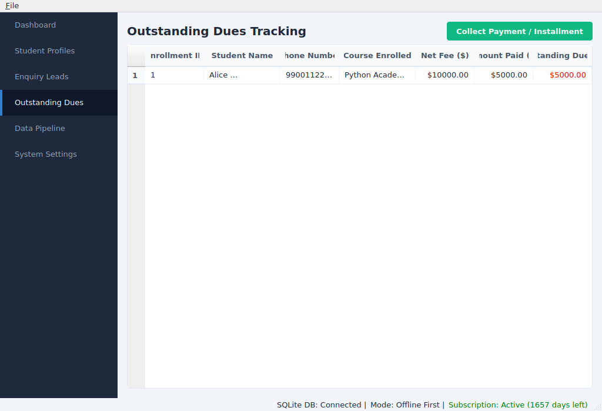 | 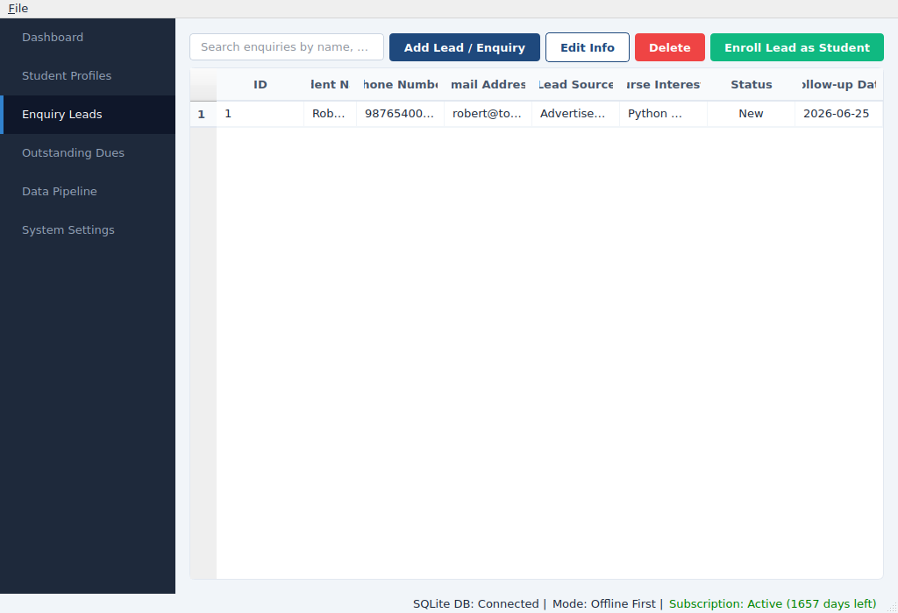 |

| Data Import | Settings |
|---|---|
| 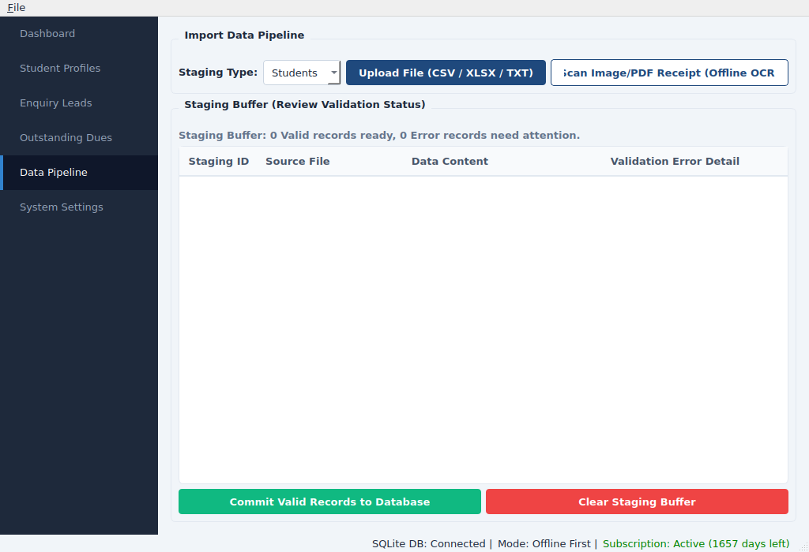 | 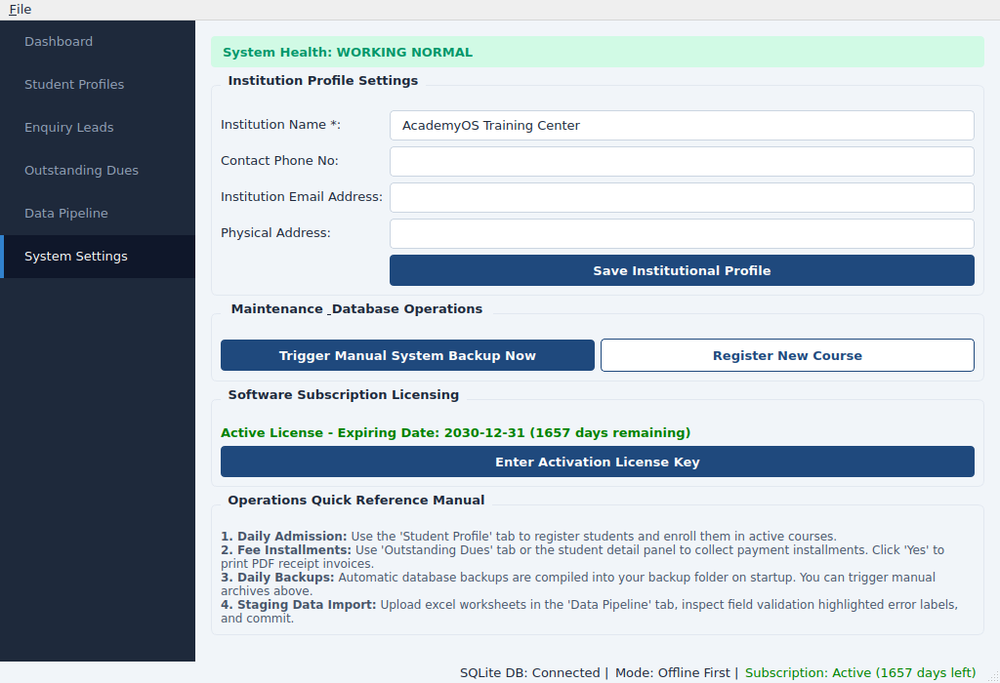 |

---

## 5. Installation & Activation Guide

### Prerequisites
*   **OS**: Windows 10+ (x64)
*   **RAM**: 4GB RAM minimum (system consumes < 300MB RAM)
*   **Storage**: 100MB free storage space
*   **Optional**: [Tesseract OCR for Windows](https://github.com/UB-Mannheim/tesseract/wiki) (required for scanned document text extraction)

### Installation
1.  Download `AcademyOS_Setup_v1.0.0.exe` from the latest release.
2.  Double-click the installer and follow the setup wizard.
3.  Check "Create a desktop shortcut" to place the shortcut on your desktop.
4.  Click **Finish** to launch the client application.

### Client Activation (Offline)
1.  On first startup, the application displays an **Activation Form** containing your **Device Fingerprint**.
2.  Copy this fingerprint and send it to your AcademyOS administrator to pay and activate your license.
3.  The administrator will generate your unique activation key (e.g. `AOS-KEY-2030-12-31-87a129eae...`) and send it to you.
4.  Paste the key into the input field and click **Activate Software** to unlock the main application.

---

## 6. Operations Guide

### Student Management
*   **Register Student**: Go to *Student Profiles*, click **Register New Student**, and enter details.
*   **Search**: Use the search bar to query by first name, last name, phone number, or email (case-insensitive).
*   **Edit/Delete**: Select any row in the list to update profile data or archive the record.

### Fees Management
*   **Collect Installment**: In *Outstanding Dues*, select the student row, click **Collect Fee**, input the payment amount and method, and click **Save**.
*   **Generate Receipt**: The app will automatically prompt you to export a professional receipt PDF.

### Excel Export
*   Go to *File -> Export Full Database to Excel* or click the export button. Select your destination directory, and the system compiles a styled spreadsheet complete with formatting, charts, and highlighted outstanding alerts.

### Staged Data Import
1.  Go to the *Data Pipeline* tab, select import type (Students, Leads, or Payments), and click **Select File**.
2.  Rows are loaded into the **Staging Area**.
3.  Any validation error (missing names, invalid phone formats, corrupted fields) is highlighted in red.
4.  Review changes and click **Approve & Commit** to merge valid records into the master database.

---

## 7. Security Notes

*   **100% Parameterized Queries**: Every database communication uses positional bindings (`?`). Dynamic queries are resilient to SQL Injection.
*   **Zip Slip Protection**: Restoring a backup validates member paths, preventing directory traversal.
*   **Obfuscated Process Execution**: Local commands are executed via argument lists without shell wrappers to block Command Injection.
*   **Spreadsheet Formula Protection**: String exports starting with formula triggers (`=`, `+`, `-`, `@`) are automatically escaped.

---

## 7. Troubleshooting & FAQ

*   **Q: Database Connection Failed error on launch?**
    *   *A*: AcademyOS requires write access to the user folder. Ensure you are running under a user account with permissions to write to `%USERPROFILE%/.academyos/`.
*   **Q: Application startup shows "Clock Tampering Detected"?**
    *   *A*: This occurs if the system clock is set to a time earlier than the last successful launch of the application. Reset your Windows system clock to the current date and time.
*   **Q: OCR Scanner not extracting text?**
    *   *A*: Ensure `tesseract.exe` is installed and its folder is added to your Windows environment variables path.

---

## 8. Version History

*   **v1.0.0 (2026-06-18)**: Initial Production Release Candidate (RC). Includes security hardening, Zip Slip validations, WAL mode database concurrency, and the standalone `license_admin_app.py` utility.

---

## 9. License

Distributed under the MIT License. See [LICENSE.md](file:///home/ubuntu/academyos/LICENSE.md) for details.
